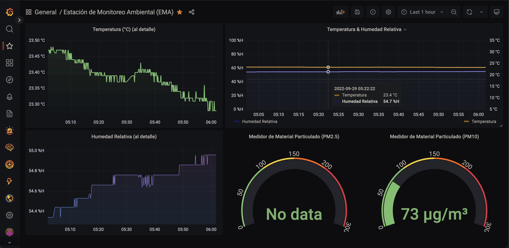

# Estación de Monitoreo Ambiental (EMA)

## Dashboard [views from Grafana](https://cxrloskenobi.grafana.net/goto/iDH3kIVVk?orgId=1)




## Steps to run

1. [Install poetry](https://python-poetry.org/docs/) in your system in order to manage the dependencies.

2. Clone the repository and install the dependencies:

```bash
cd EMA_Source/
poetry install
```

3. Run the application:

```bash
bash run.sh
```
